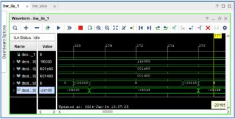

Chapter 2

FPGA Implementation of Digital

Spiking Neuron

1. Introduction

Membrane potential in biological neuron rises upon receiving a stimulus as Na+ gate opens and sodium ions rushes into the neuron and voltage increases till it reaches a peak potential then k+ gate open and Na+ closes, k+ ion now move out of the membrane resulting in decrease in potential. This causes spiking in neuron after receiving a stimulus.

Figure 2.1: Spiking in biological Neuron [\[1\]](#_page7_x113.39_y229.05)

Traditional artificial neural network and convolutional neural networks are unable to simulate the dynamic behaviour of biological neuron. Spiking Neural Network(SNN) can better emulate the behaviour of biological Neuron.

Various spiking model have been proposed to mimic the biological neuron. There are two models at two extremes :

1. Hodgkin-Huxley(HH) model : Model is computationally expensive but can reproduce various spiking pattern as seen in biological Neuron.
1. Leaky integrate and Fire (LIF) model is computationally simple but can simulate the simplest spiking dynamic

Then there is Izhikevich (IZH) model which uses only two equations to model the neuron dynamic yet is able to reproduce a variety of spiking patterns. Therefore it is considered a computationally efficient and biological plausible neuron.

2. Modelling IZH for Digital Design

IZH mo[del\[2\]](#_page7_x113.39_y259.93) proposed was following:

v′ = 0.04v2 + 5v + 140 − u + I

u′ = a(bv− u)

v ← c

th, then u ← u + d if v ≥ v

where v is membrane potential, u is recovery variable, and I is the synaptic current. v′ = dv and u′ = du

dt dt

a, b, c, d is are parameters that decide the spiking patterns of neurons.

Membrane potential is in mV, time scale is ms.

The problem with these equation for digital implementation of system is that it involve quadratic equation, and to model that will require multiplier which increases power con- sumption and critical delay path, thereby reducing the overall throughput of the design.

The digital design discussed here for IZH modelled is taken from[3],[ pap](#_page7_x113.39_y291.81)er avoids the use of multiplier by estimating quadratic function with help of cosh which further can modelled using 2x function as :

21\.44x + 2−1.44x

cosh(x) =

2

This approximation of v2 is valid can be understood using following graphs

Figure 2.2: Comparison of x2, cosh(x), 21.44x+2−1.44x

2

This approximation is usefull because in the design pipeline as x will get values ranging from −2806 to 8026 this allows following:

- x has integer part( xi) and fractional part( xf ) so, x = xi + xf ∴2x = 2xi × 2xf
- x has 1, -1, 0 as integer part( xi), so this integer part make 2 xf multiply or divide by 2 or multiply by 1. Now this multiplication by 2 can be achieved by single left shift and division by 2 can be achieved by single right shift operation on a given number.
- x has fractional part, and this 2 xf can be estimated using x

  if −1 < xf < 0 : 2f = 1 + 0.5xf

  else 0 < xf < 1 : 2f = 1 + xf

x

- So 2x for given range can be approximated by calculating 2 xf as mentioned above and shifting 2xf by left shift operation or right shift to multiply or divide by 2 to model effect of 2xi . So just by shift and addition operation we avoided using a complete multiplier.

Next we discretize the system of IZH model using euler method so model presented in the paper is

v[n + 1] = v[n] + dt (k1 cosh(k2(v[n] + k3)) − k4 − u[n] + I[n]) (2.1) u[n + 1] = u[n] + dt (a(bv[n]− u[n])) (2.2)

Values for different parameter as given by author

k1 = 380

k2 = 0.0145

k3 = 62.5

k4 = 396.25

a = 0.01953125 = 2−6 + 2−8

b= 0.203125 = 2−3 + 2−4 + 2−6]

Table 2.1: c, d Parameters for different Neuron Types

|Neuron Type|c|d|
| - | - | - |
|Regular Spiking|-80|15|
|Fast Spiking|-80|7\.25|
|Chattering|-56|4\.75|
|Intrinsically Bursting|-61|8\.5|

3. Digital Implementation of Model
1. Number Representation

We will using 2’s complement representation for signed numbers.

Secondly we will use fixed point arithmetic to represent floating point number. Total size of register for storing a number will be 21 bits of which 11 bits for integer part and 9 bits for fractional part.

2. Block Diagram

Block diagram given in the paper was modified as:

Figure 2.3: Modified Block Diagram for Digital Design

We introduced buffers to avoid the mismatch of v and u value in pipeline. Secondly we introduced tri-state buffer which results in v taking value only when one complete cycle of producing v has taken place. Thirdly we corrected the u pipeline. Exponential Block

Figure 2.4: Exponential Block

3. Difference in Actual vs Modelled values

Table 2.2: Parameters : Actual vs Modelled

||Actual Values|Modelled Values|
| :- | - | - |
|k1|380|380|
|k2|0\.0145|0\.015625|
|k3|62\.5|70|
|k4|396\.25|396|

4. Hardware Implementation

Note : Below in text v, finalv, voltage refers to membrane potential.

1. Code

Code for the project can be accesed using following link to github repository : [Link to Github Repository](https://github.com/tensionTaker/DigitalNeuron_v2)

2. Simulation Plots

Every plot is have vertical axis in the range -80 to 30 mV Sampling frequency is 701ns = 14MHz

Regular Spiking

Time period of Spikes is 48µs

Figure 2.5: Regular Spiking

Fast Spiking       Time Period is 25µs

Figure 2.6: Fast Spiking

Chattering

Figure 2.7: Chattering

Intrinsically Bursting

Figure 2.8: Enter Caption

3. Hardware Verification

To verify that the design is synthesizable and shows expected behaviour we can use VIO(Virtual Input and Output) and ILA(Integrated Logic Analyzer). VIO and ILA are available as IP block in Vivado.

Figure 2.9: Final block diagram with VIO and ILA for testing Verification observation

- Hardware is initialized properly when set = 1, when set = 1 v(membrane potential) is initialized with -70 mV.

Figure 2.10: ILA outputs when set = 1

- When current is 0, voltage(membrane potential) is constant, that is ( − 32831× 2− 9) = −64.1mV.

Figure 2.11: ILA output when current is 0

- When there is some current the data between v(membrane potential) and finalv(another variable in code to record v continuously) flows as expected and in the expected range.

Figure 2.12: ILA output when there is current

- Another way to verify is to collect data from ILA over a time in csv and then plot but problem with this method is it looses data samples between two instances of ILA as it take some time to run ILA and then download the data. This can be seen in plot below.

Figure 2.13: ILA data collected over time and plotted

References

1. Dan F. M. Goodman and Marcus Ghosh. Neuroscience for Machine Learners. https://doi.org/10.5281/zenodo.10366802, 2023.
1. E.M. Izhikevich. Simple model of spiking neurons. IEEE Transactions on Neural Net- works, 14(6):1569–1572, 2003.
1. Junran Pu, Wang Ling Goh, Vishnu P. Nambiar, Yi Sheng Chong, and Anh Tuan Do. A low-cost high-throughput digital design of biorealistic spiking neuron. IEEE Transactions on Circuits and Systems II: Express Briefs, 68(4):1398–1402, 2021.
22
